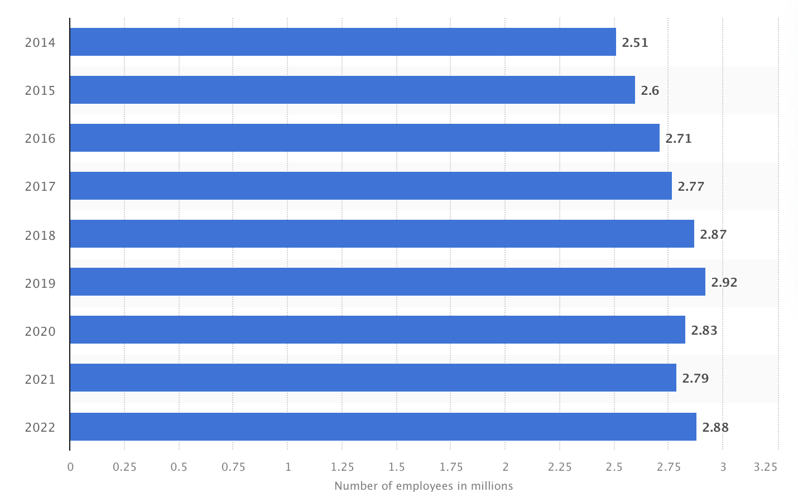

# 1. Introduction

The idea is to explore how the use of Large Language Models (LLMs) as General Purpose Technology (GPT) could reshape industries, considering the generalization capabilities of LLMs and the rapid adoption of these tools by the public and firms.

A. Background on the potential economic impact of Large Language Models (LLMs) as General Purpose Technology (GPT) 
B. Objective of the paper: Exploring how the use of LLMs as GPT could reshape industries and contribute to economic growth

Generalization of tools seems to be an important characteristic to leverage the potential of growth and development, because if a same tool could be broad use for different purposes, so the tool becomes in a very valuable tool.

Until now the abilities reached by the Large Languages Models LLMs have arisen to a certain level of computational power that might require scaling up past this threshold (10^23 training FLOPs), meaning that they are able to perform multiple tasks related to Text Understanding and Generation,Problem Solving and Mathematics, Image and Data Classification, Text Analysis and Comprehension, and so on, but as [@weiemergent] suggested for future works, it could be possible new abilities could emerge scaling up the models and understanding how emergence occurs would provide new insights into how to train more-capable language models.

On the other hand, the use of LLMs as a base technology of other tools, such as software-AI powered, open a new window and enveloped the potential of productivity improvements of the work-human force or human capital as it was mention by [@gptaregpts] telling that LLMs such as GPTs exhibit traits of general-purpose technologies, could have considerable economic, social, and policy implications.

So, the potential arising of emergent abilities and the wide use of LLMs as enablers of new tools (AI based-software) alongside the spread use of tools such as ChatGPT by a large amount of humans (here: million of users of chatGPT), it could signify a future unseen before by the human beings, because the expansion and pushing of new boarders and limits would be accelerated.

# Generalization Capabilities of LLMs as GPT 
A. Examining the adoption rate of previous GPTs 
B. Key factors contributing to the widespread adoption of a technology as a GPT 
C. Reviewing the literature on the potential of AI as a GPT

Artificial intelligence a term coined by emeritus Stanford Professor John McCarthy in 1955, was defined by him as “the science and engineering of making intelligent machines”.[^1] These systems are designed to simulate human cognitive abilities, such as learning, reasoning, problem-solving, perception, and language understanding. Within the realm of AI, Large Language Models (LLMs) are a specific type of AI model that utilizes deep learning techniques, particularly neural networks, to process and generate human-like language. LLMs are trained on vast amounts of text data and can perform tasks like language translation, text summarization, and question answering. 

In the past, computer programs were developed by painstakingly encoding human knowledge, following a precise set of instructions that mapped specific inputs to desired outputs. This approach required programmers to meticulously define every step of the process. However, machine learning systems operate differently. They utilize general algorithms, such as neural networks, which enable them to independently determine the appropriate mapping between inputs and outputs. This is achieved through exposure to extensive datasets containing numerous examples. By analyzing and learning from these examples, machine learning systems can identify patterns and make accurate predictions or classifications without explicit programming instructions.

General Purpose Technology is a transformative technology with a strong improvement process at the begining and eventually becoming widely adopted for its multiples uses, while producing many spillover effects [@paradox]. As such, it have a pervasive impact on society as a whole, mainly due to its capability to redefine the ways in which businesses operate, improve productive and contribute to long-term economic growth. Some well-know examples are steam power, electricity, semiconductors, and internet.

[^1]: Available at: https://hai.stanford.edu/sites/default/files/2020-09/AI-Definitions-HAI.pdf

# Assessing the Potential Economic Impact 

Considering the potential of the AI as a new GPT, specifically the LLMs, assessing its potential economic impact to setting expectatives, it could be address based on a retrospective approach what it means that the behaviour of previous General Purpose Technology like internet, electricity or semiconductors, can give a more realistic answer to this question, given the current conditions of uncertainty of this time.

It is worth noting that the article by [@paradox] was written seven years before the launch of ChatGPT by OpenAI. This temporal context adds significance to the insights provided by [@paradox], as they were able to anticipate and discuss the potential impact of artificial intelligence (AI) technologies on productivity growth before the emergence of specific AI models like ChatGPT. Their analysis and observations offer valuable perspectives on the productivity paradox and the clash between expectations and statistical realities in the context of technologies with the potential to become GPTs.

This apparent incongruence relies on the time lag between invention and the full impact on the economy and society. It takes time to build the stock of the new technology, develop the necessary human capital skillset, undergo the re-engineering process of business process transformations, and develop complementary innovations for its full realization.

One example mentioned by [@paradox] is the call center industry, which had approximately 2.2 million agents in the United States. It was plausible at that time to anticipate that voice recognition systems like IBM's Watson could potentially reduce the number of workers by 60%. However, in hindsight, it is evident that the expectations have not been fully met, as shown in Figure \ref{fig1}, which illustrates the statistics.


```{r path, echo = FALSE, include = FALSE}
rm(list=ls())
getwd()
path_sript <- rstudioapi::getActiveDocumentContext()$path
path_folder <- dirname(path_sript)
setwd(path_folder)
```


```{r fig1, fig.width = 5, fig.height = 5, fig.align='center', out.width="70%", fig.cap = "\\label{fig1}Number on contact center employees in the United States from 2014 to 2022.", echo = FALSE}

```

The positive expectations surrounding new technologies driving development, economic growth, and generating profits are often accompanied by optimism from industry leaders, technology experts, and venture capitalists. This optimism leads to speculative investments and forecasts of future company wealth in the financial sector. However, as [@paradox] suggests, there is no inherent contradiction between forward-looking technological optimism and backward-looking disappointment. Both can coexist, particularly during periods of transformative change. This can be attributed to human nature, as individuals desire to see their expectations fulfilled within their lifetime. However, it takes time for society to fully incorporate and benefit from new technologies, resulting in a slower pace of assimilation.

B. Evaluating the potential economic impact in terms of value creation and cost optimization 
  1. Real cases of successful implementations of LLMs for value creation 
  2. Real cases of successful implementations of LLMs for cost optimization 
  
  | Value Creation | Cost Reduction | Reference |
|----------------|----------------|----------------|
| Deep neural network system matches the diagnostic performance of 21 board certified dermatologists in detecting skin cancer. |   | [@cancer]  |
| Row 2 Value 1  | Row 2 Value 2  | Row 1 Value 2  |
| Row 3 Value 1  | Row 3 Value 2  | Row 1 Value 2  |
| Row 3 Value 1  | Row 3 Value 2  | Row 1 Value 2  |


-----
Total Factor Productivity should reflect the exceptional technological advance

Review data: CBInsights
- Labour Productivity Growth vs Global Investment focused on AI
- OECD Productivity Growth
- Real Median income has stagnated since the late 1990s 

Both capital deepening and total factor productivity (TFP) growth lead to labor productivity growth, and both seem to be playing a role in the slowdown

The old adage that “past performance is not predictive of future results” applies well to trying to predict productivity growth in the years to come, especially in periods of a decade or longer. Historical stagnation does not justify forward-looking pessimism. Taken from Paradox


C. Intangible capital - capital may not be reflected in the measurements of economic growth


AI developing skills: Perception and cognition

# LLMs vs. Artificial General Intelligence (AGI) 
A. Understanding the difference between LLMs and AGI 
Large Language Models (LLMs) and Artificial General Intelligence (AGI), represent distinct approaches to AI. Understanding their differences and how they link together is crucial in navigating the evolving landscape of AI research and applications.
AGI, as defined by [@Zhou2023PathTM] is a highly autonomous entity with the remarkable capacity to comprehend, learn, and apply knowledge across an extensive array of tasks and domains. Unlike narrow AI systems, AGI aims to replicate the breadth of human cognitive abilities. This ambition makes AGI the pinnacle objective within the field of artificial intelligence.
One of the key distinctions between LLMs and AGI lies in their scope of intelligence. LLMs are specialized, focusing solely on language-related tasks. Another critical difference is in learning and adaptation. AGI systems, are designed for continual learning and adaptation. As described by [@Wang2012Chapter1I] AGI’s ability to be generalized on fundamentally new areas.


B. Exploring whether AGI is the real General Purpose Technology

The question of whether AGI can be considered the real General Purpose Technology is soon to become more relevant, as AGI has not yet reached its full potential and audience. While advanced LLM models like OpenAI's ChatGPT have undoubtedly revolutionized the way people work in a wide range of tasks, they represent just a glimpse of what AGI could ultimately achieve.
AGI, with its aspiration to replicate human-like general intelligence across various domains, holds the promise of transcending the limitations of narrow AI and becoming the ultimate tool for problem-solving and innovation. Paper by [@Mikki2023ArtificialGI] introduces the intriguing idea that achieving AGI may necessitate noncomputable systems. This concept challenges conventional thinking in AI by encouraging us to expand our understanding of AGI's potential. It suggests that AGI might require unconventional approaches beyond traditional computational frameworks.
While AGI has not yet fully realized its capabilities, it holds the promise of reshaping the technological landscape. Mikki's proposal of noncomputable systems, when integrated with other development ideas, offers a tantalizing glimpse into the future of AGI, where its transformative power knows no bounds.

# Acknowledging Benefits and Limitations of LLMs as GPT 
A. Discussing the potential benefits of LLMs as GPT

One of the significant advantages of incorporating LLMs as GPT is the potential for substantial productivity gains. LLMs excel in natural language understanding and generation, making them valuable tools for automating tasks that involve processing and generating text. From content generation to customer support automation, LLMs can streamline processes, reduce labor costs, and boost efficiency. By automating routine language-related tasks, they free up human resources to focus on more creative and complex endeavors. In fields such as finance, healthcare, and market analysis, LLMs can assist in extracting valuable insights from unstructured data, leading to better-informed decisions and strategies.

B. Addressing the limitations and challenges associated with LLMs as GPT

While LLMs offer significant potential as GPT, it is essential to acknowledge the limitations and challenges associated with their widespread adoption. The use of LLMs raises ethical concerns, particularly in content generation and manipulation. LLMs rely on large datasets for training, often containing sensitive information. Safeguarding data privacy and ensuring compliance with data protection regulations is an ongoing challenge that must be addressed to harness the full potential of LLMs. 

# Conclusion 
A. Summarizing the main points discussed in the paper
Large Language Models (LLMs) have showcased formidable capabilities, from text understanding to image classification, marking their potential role as a pivotal General Purpose Technology (GPT). Their swift adoption by businesses and the general public underscores their transformative nature. Historically, the essence of AI lies in simulating human cognitive functions, and LLMs, leveraging deep learning, bring us closer to that vision. Their inherent generalization capabilities position them as potentially revolutionary and universally applicable.
An essential part of the AI spectrum is Artificial General Intelligence (AGI). Unlike LLMs that are task-specific, AGI aims to encompass a broad spectrum of human cognitive abilities. The debate around whether AGI could emerge as the true GPT poses critical questions on the future trajectory of AI, given AGI's ambition to mitigate AI limitations and offer a holistic solution to diverse problems.
B. Emphasizing the potential of LLMs as GPT in reshaping industries
LLMs, as a foundational technology for other AI-powered tools, have the potential to radically enhance productivity and foster economic growth. Their wide applicability, illustrated by tools like ChatGPT, hints that the near future will be characterized by rapid technological evolution and boundary expansion. This potential is even more profound when considering the eventual emergence of AGI, which could amplify the transformative impact of AI technologies exponentially.
While challenges remain, particularly in the realms of data privacy and ethical considerations, the benefits of LLMs, such as improved productivity and refined decision-making, are undeniable. Industries across sectors stand to gain from the generalization capabilities of LLMs, whether it's automating repetitive tasks or deriving insights from complex data.


# Bibliography styles

Here are two sample references: @Feynman1963118 [@Dirac1953888].

By default, natbib will be used with the `authoryear` style, set in `classoption` variable in YAML. 
You can sets extra options with `natbiboptions` variable in YAML header. Example 
```yaml
natbiboptions: longnamesfirst,angle,semicolon
```

There are various more specific bibliography styles available at
<https://support.stmdocs.in/wiki/index.php?title=Model-wise_bibliographic_style_files>. 
To use one of these, add it in the header using, for example, `biblio-style: model1-num-names`.

## Using CSL 

If `citation_package` is set to `default` in `elsevier_article()`, then pandoc is used for citations instead of `natbib`. In this case, the `csl` option is used to format the references. Alternative `csl` files are available from <https://www.zotero.org/styles?q=elsevier>. These can be downloaded
and stored locally, or the url can be used as in the example header.

# Equations

Here is an equation:
$$ 
  f_{X}(x) = \left(\frac{\alpha}{\beta}\right)
  \left(\frac{x}{\beta}\right)^{\alpha-1}
  e^{-\left(\frac{x}{\beta}\right)^{\alpha}}; 
  \alpha,\beta,x > 0 .
$$

Here is another:
\begin{align}
  a^2+b^2=c^2.
\end{align}

Inline equations: $\sum_{i = 2}^\infty\{\alpha_i^\beta\}$


# Tables coming from R

Tables can also be generated using R chunks, as shown in Table \ref{tab1} for example.

```{r tab1, echo = TRUE}
knitr::kable(head(mtcars)[,1:4], 
    caption = "\\label{tab1}Caption centered above table"
)
```

# References {-}

